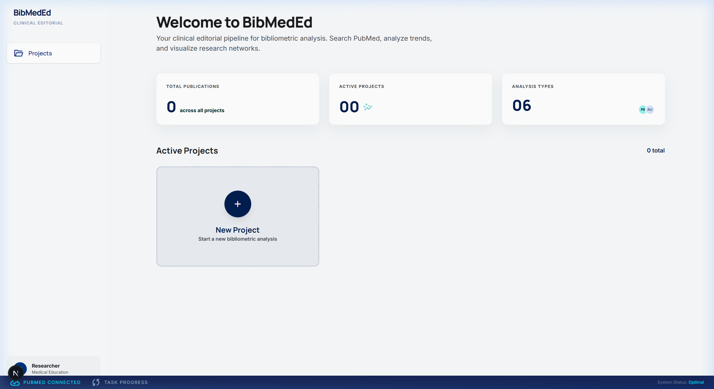
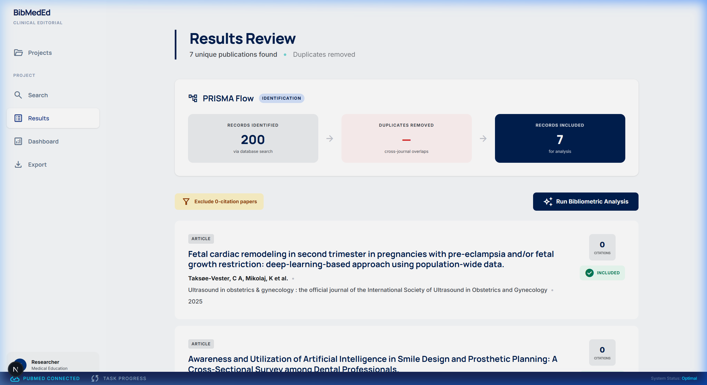
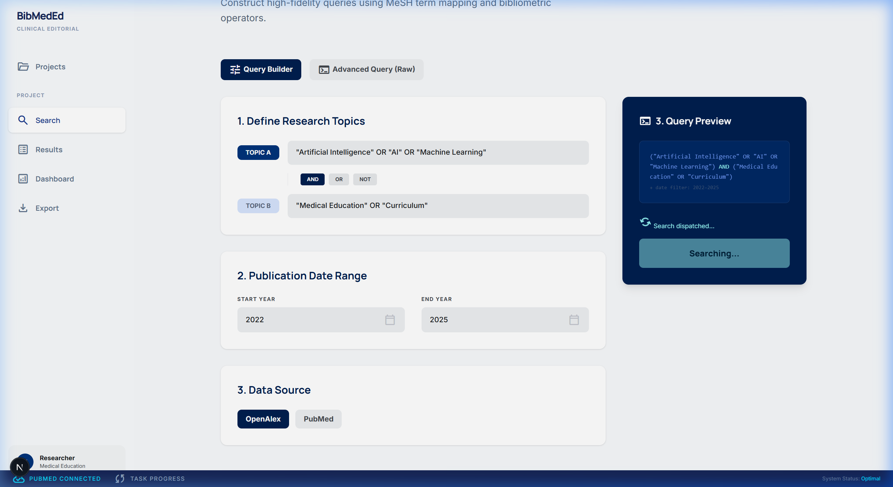

# BibMedEd

**Bibliometric Analysis Platform for Medical Education**

BibMedEd is an open-source tool that enables medical education researchers to search bibliographic databases and perform comprehensive bibliometric analysis — all in one integrated platform. It replaces the fragmented workflow of PubMed search + Covidence + VOSviewer + CiteSpace + Excel.

## Features

- **Multi-database search** — Query PubMed, OpenAlex, and any database with a community adapter
- **Automated deduplication** — Cross-database dedup by DOI and PMID
- **Six analysis modules** — Publications, authors, countries, keywords, citations, journals
- **Interactive visualizations** — D3.js co-authorship and keyword co-occurrence networks
- **Reproducible methodology** — Every pipeline step logged and exportable as a citable `.txt` file
- **Standard exports** — .RIS (Zotero/EndNote), .CSV (Excel/Sheets), methodology log

## User Interface Tour

The BibMedEd Agentic QA recording demonstrates the dynamic features, layout scaling, and state preservation:
<p align="center">
  
</p>

### **Dashboard Analysis & Search Pipeline**
The system gracefully visualizes bibliometric markers and updates fetching blocks via Celery sockets.
<p align="center">
  
  
</p>
<p align="center">
  
</p>

## Quick Start

```bash
git clone https://github.com/ata381/BibMedEd
cd BibMedEd/bibmeded
docker compose up
```

Open [http://localhost:3000](http://localhost:3000) and start analyzing.

See the [Self-Hosting Guide](deploy.md) for configuration options.

## Extend It

BibMedEd uses a plug-and-play adapter pattern. Adding a new data source is a single Python file (~50 lines) that implements three methods. See the [Writing Adapters](adapters.md) guide.

## Cite

If you use BibMedEd in your research, please cite:

```bibtex
@software{bibmeded,
  title={BibMedEd: Bibliometric Analysis Platform for Medical Education},
  author={Ata, Aakil},
  year={2026},
  url={https://github.com/ata381/BibMedEd}
}
```

## License

[MIT](https://github.com/ata381/BibMedEd/blob/master/LICENSE)
