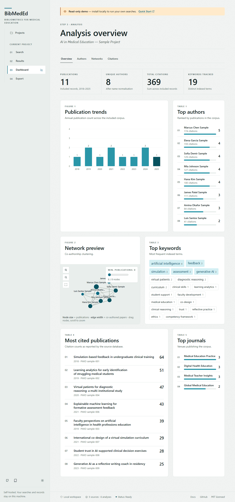
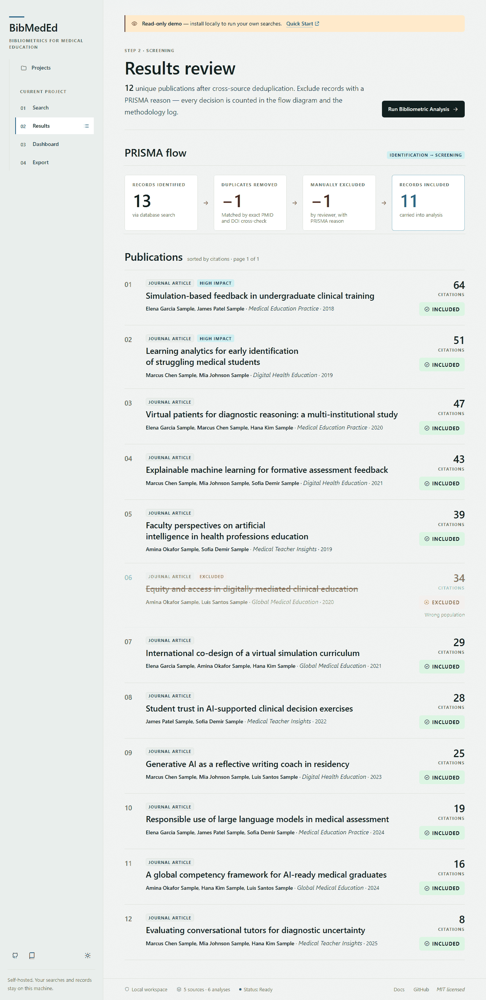
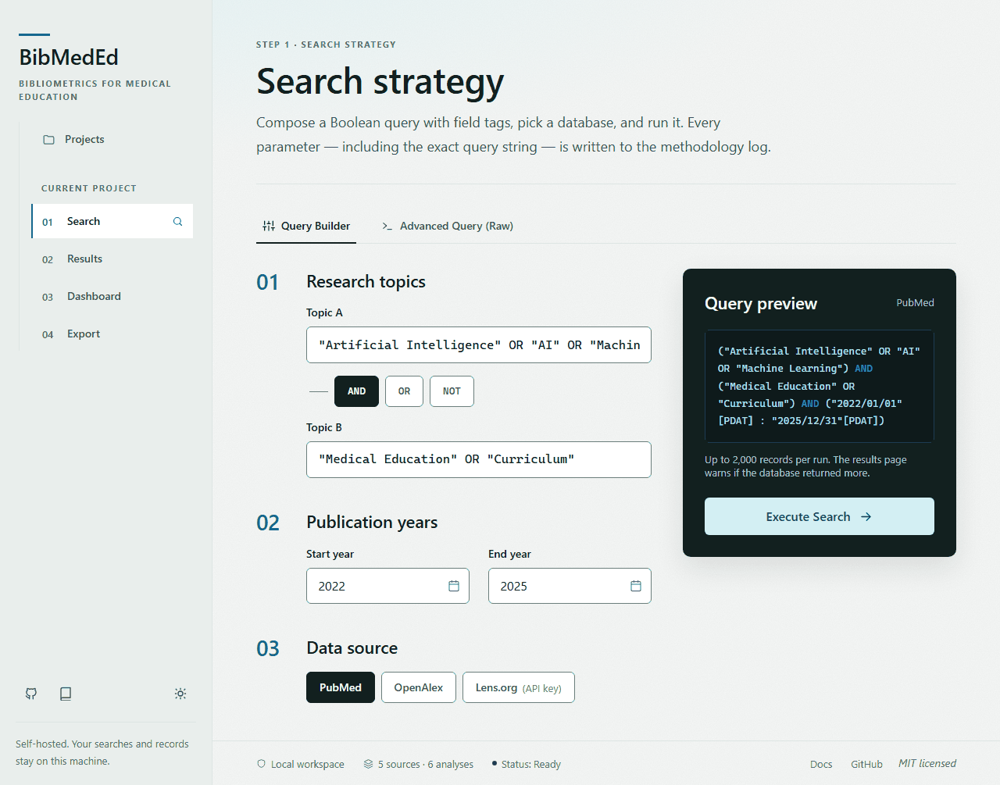

# BibMedEd

**Bibliometric Analysis Platform for Medical Education**

BibMedEd is an open-source tool that enables medical education researchers to search bibliographic databases and perform comprehensive bibliometric analysis — all in one integrated platform. It replaces the fragmented workflow of PubMed search + Covidence + VOSviewer + CiteSpace + Excel.

## Features

- **Multi-database search** — Query PubMed, OpenAlex, CrossRef, Semantic Scholar, and Lens.org
- **Automated deduplication** — Cross-database dedup by DOI and PMID
- **Six analysis modules** — Publications, authors, countries, keywords, citations, journals
- **Interactive visualizations** — D3.js co-authorship and keyword co-occurrence networks
- **Reproducible methodology** — Every pipeline step logged and exportable as a citable `.txt` file
- **Standard exports** — .RIS (Zotero/EndNote), .CSV (Excel/Sheets), methodology log

## User Interface Tour

The screens below show the main steps of the workflow, from search to analysis.

### Dashboard analysis and search pipeline

The search page builds and previews the query, the results page shows PRISMA flow counts and screening, and the dashboard visualizes bibliometric indicators. Every screenshot and the README walkthrough come from the bundled synthetic sample project (13 records, 1 duplicate removed, 1 excluded, 11 analysed), captured from the [local read-only demo](deploy.md#run-the-demo-locally) (`docker compose -f docker-compose.demo.yml up`), so you can reproduce them exactly.
<p align="center">
  
  
</p>
<p align="center">
  
</p>

## Quick Start

```bash
git clone https://github.com/ata381/BibMedEd
cd BibMedEd/bibmeded
docker compose up
```

Open [http://localhost:3000](http://localhost:3000) and start analyzing.

For first-run exploration, use **Explore sample project** on the empty workspace to populate a clearly labeled synthetic corpus and test the analysis workflow end-to-end right away. The sample remains editable like any other project; delete it and load it again whenever you want to restore the bundled dataset.

See the [Self-Hosting Guide](deploy.md) for configuration options.

## Extend It

BibMedEd uses a plug-and-play adapter pattern. A new data source starts with one focused Python module plus fixture-based tests and any source-specific setup notes. See the [Writing Adapters](adapters.md) guide.

## Join the community

Researchers can share workflow feedback, and developers can claim a focused adapter or starter issue. See the [community page](community.md) for the shortest path.

## Cite

If you use BibMedEd in your research, please cite:

```bibtex
@software{bibmeded,
  title={BibMedEd: Bibliometric Analysis Platform for Medical Education},
  author={Akillioglu, Ata},
  year={2026},
  url={https://github.com/ata381/BibMedEd},
  doi={10.5281/zenodo.20404321}
}
```

The canonical machine-readable citation is [`CITATION.cff`](https://github.com/ata381/BibMedEd/blob/master/CITATION.cff) — GitHub's "Cite this repository" button generates BibTeX from it automatically.

## License

[MIT](https://github.com/ata381/BibMedEd/blob/master/LICENSE)
